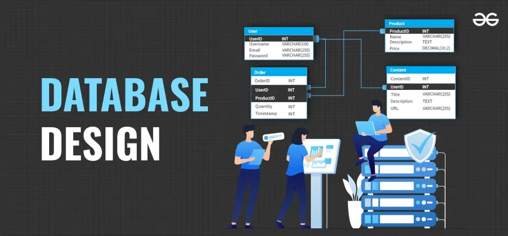

# http-5126
Database Design and Development 
# HTTP-5126 Project 🚀

Welcome to the **HTTP-5126** project repository! This repository contains all the source code, documentation, and resources for building and developing the **HTTP-5126** web application. 

## 🔗 Project Link

For more details, please visit the project on GitHub:  
[GitHub Repository](https://github.com/RaginiS19/http-5126.git)

## 🖼️ Project Screenshot



> **Note:** This project is under active development. Please check back for future updates! 💻

## 📚 Project Overview

The **HTTP-5126** project is designed to provide a scalable and efficient backend solution for managing HTTP requests and responses. It serves as a foundation for learning and experimenting with backend web development using modern 

# HTTP-5126 Project 🚀

Welcome to the **HTTP-5126** project repository! This repository contains all the source code, documentation, and resources for building and developing the **HTTP-5126** web application. 

## 🔗 Project Link

For more details, please visit the project on GitHub:  
[GitHub Repository](https://github.com/RaginiS19/http-5126.git)

## 🖼️ Project Screenshot


> **Note:** This project is under active development. Please check back for future updates! 💻

## 📚 Project Overview

The **HTTP-5126** project is designed to provide a scalable and efficient backend solution for managing HTTP requests and responses. It serves as a foundation for learning and experimenting with backend web development using modern technologies.

### Key Features:
- 🌐 RESTful API endpoints for seamless integration
- 🔒 Secure authentication and user management
- 📊 Detailed logs and metrics for monitoring
- 💡 Easily extendable for future growth

## ⚙️ Technologies Used

- **Python** 🐍
- **Flask** for backend development
- **SQLite** for database management
- **Docker** for containerization

## 💻 Code Sample

Here’s a simple Python function from the project that prints "Hello, World!" to the console:

```python
def hello_world():
    print("Hello, World!")
    
hello_world()  # Output: Hello, World!
